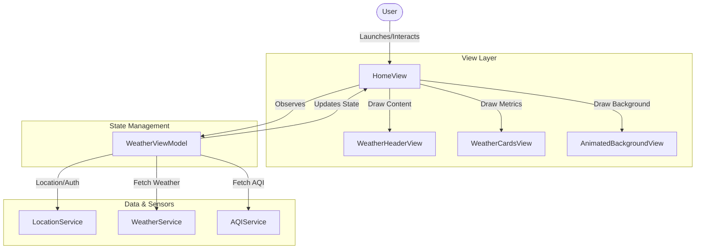

# Architecture & Core Design Patterns

This document describes the architectural layout, class flows, and design decisions made in the **Weather Wizard** application.

---

## 1. Architectural Overview (MVVM)

The application adheres to the Model-View-ViewModel (MVVM) structural pattern combined with protocol-driven Services to ensure decoupling, testability, and clean separation of concerns.

### Models
- **WeatherResponse**: Decodes parameters like Celsius temperature, precipitation probability, and windspeed.
- **AQIResponse**: Decodes US Air Quality Index (AQI), PM2.5, and PM10 metrics.
- **WeatherData**: A clean, immutable aggregate structure containing normalized weather indices, descriptive conditions, and local neighborhood/city names.
- **AppState & AppError**: Categorize the UI's loading, loaded, or localized error states.

### View
- Pure SwiftUI views reacting directly to `@Published` properties from the ViewModel. The layout separates presentation structures into sub-components (`WeatherHeaderView` and `WeatherCardsView`).
- **AnimatedBackgroundView**: A bottom-layer view running entirely via GPU rendering logic.

### ViewModel
- **WeatherViewModel**: Annotated with `@MainActor` to isolate UI state updates to the main thread. It acts as the single source of truth, subscribing to the system location updates via Combine publishers and executing concurrent API actions.

---

## 2. Service Layer & Concurrency

All service communications use modern Swift Concurrency (`async/await`) instead of completion handlers.

- **LocationService**: Implements `CLLocationManagerDelegate` to request single location fixes on-demand. When coordinates arrive, it utilizes `CLGeocoder` to reverse-geocode coordinates into user-friendly localized city strings.
- **WeatherService & AQIService**: Separate structs responsible for URL building and parsing. They use `URLSession.shared.data(from:)` and handle low-level connection errors, translating them into defined `AppError` cases:
  - `URLError` connection failures -> `AppError.noNetwork`
  - Unsuccessful HTTP response codes -> `AppError.apiUnavailable`

---

## 3. High Performance Rendering

The background effects are designed to run with minimal CPU intervention.

- Rather than using traditional UIKit animations or multiple overlaying SwiftUI Views (which require high CPU layout pass overhead), all particles are drawn within a single SwiftUI `Canvas` driven by a `TimelineView(.animation)`.
- **Pre-computed Seed Arrays**: Particle indices (twinkle speeds, initial positions, fall directions, sway frequencies) are initialized once when the static memory registers. No new arrays are allocated inside the drawing cycle to prevent frame rate drops.
- **Deterministic Lightning**: The sheet lightning effects are mapped mathematically to modulo bounds of the elapsed time (`elapsed.truncatingRemainder(dividingBy: 9.5)`), requiring zero `@State` invalidations.
